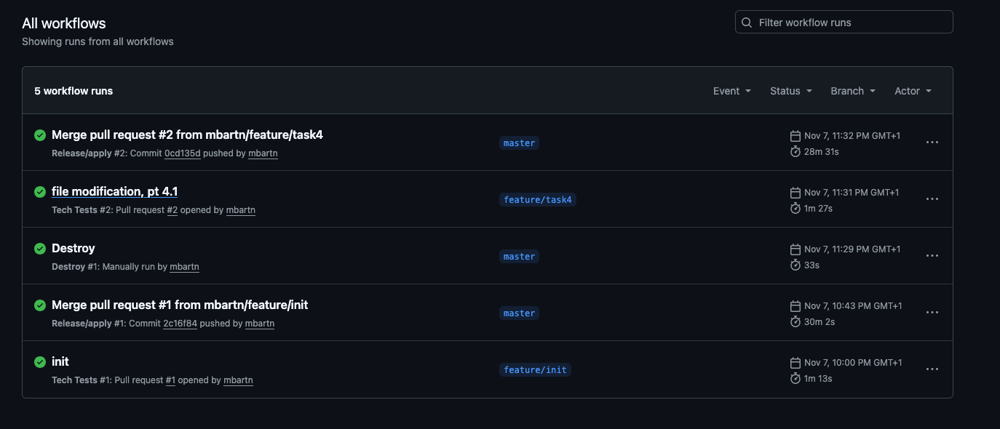
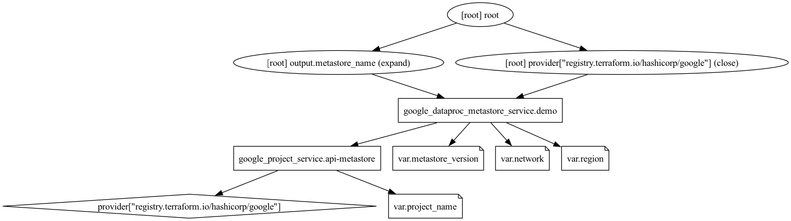
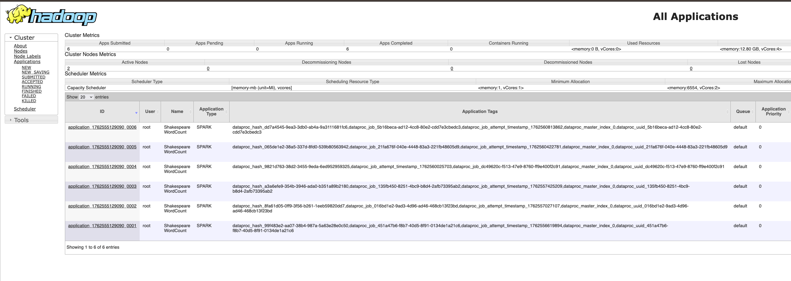
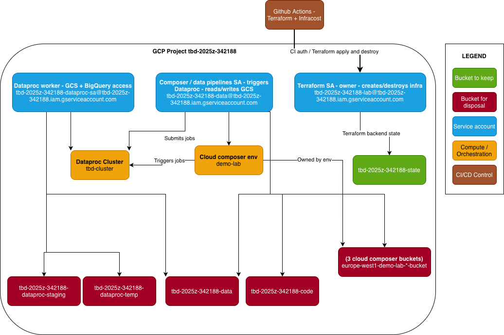
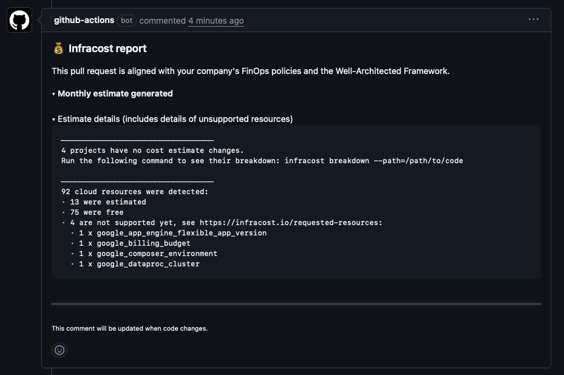
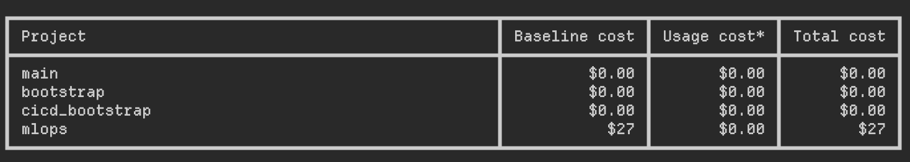
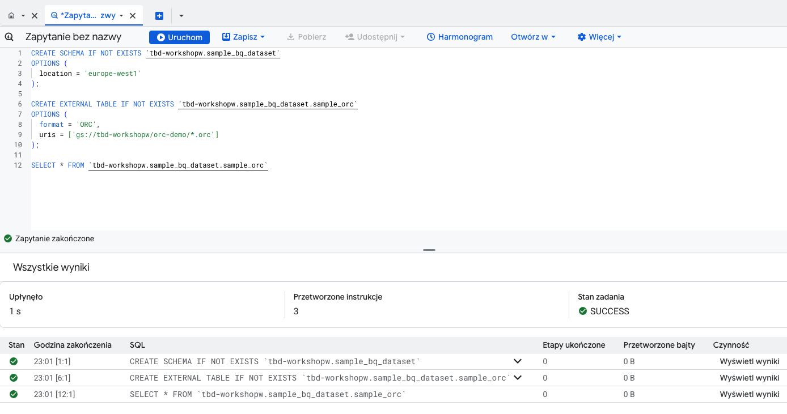
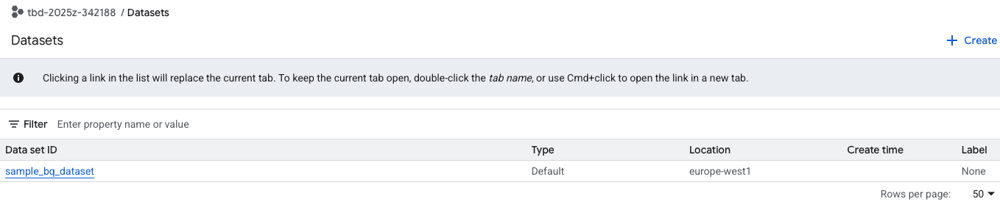
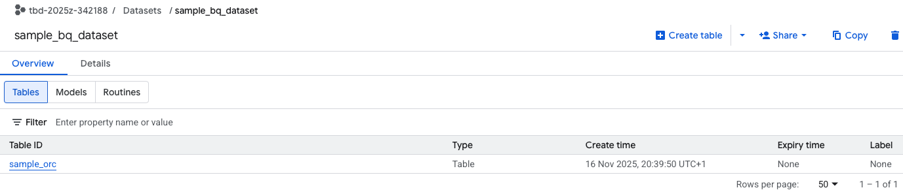
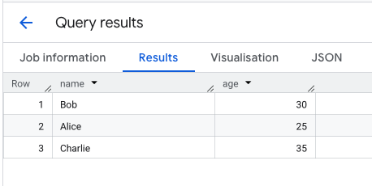

IMPORTANT ❗ ❗ ❗ Please remember to destroy all the resources after each work session. You can recreate infrastructure by creating new PR and merging it to master.
  


1. Authors:

   ***Grupa z10***

   ***https://github.com/mbartn/tbd-workshop-1***
   
2. Follow all steps in README.md.

3. From avaialble Github Actions select and run destroy on main branch.
   
4. Create new git branch and:
    1. Modify tasks-phase1.md file.
    
    2. Create PR from this branch to **YOUR** master and merge it to make new release. 

    3. 

5. Analyze terraform code. Play with terraform plan, terraform graph to investigate different modules.

    
 
    ***Metastore***
   
    Metastore module deploys the Dataproc Metastore - a fully managed Apache Hive Metastore. 
    It can be used to manage data lake metadata and to provide interoperability between the various data processing 
    engines and tools that are in use.

    The module exposes 4 input variables - `project_name`, `region`, `network` and `metastore_version`. 
    
    Two resources are being created: 
    - `google_project_service` - enables Google Cloud metastore API
    - `google_dataproc_metastore_service` - deploys the actual service. 
    
   
6. Reach YARN UI
   
    ```bash
    gcloud compute ssh tbd-cluster-m --zone "europe-west1-d" --tunnel-through-iap --project "tbd-2025z-342188" -- -L 8088:localhost:8088
    ```
   
   
7. Draw an architecture diagram (e.g. in draw.io) that includes:
    1. Description of the components of service accounts
    2. List of buckets for disposal
    


**Service accounts:**
- `tbd-2025z-342188-lab@tbd-2025z-342188.iam.gserviceaccount.com` - **Terraform SA (Owner)** - used by CI to create/destroy resources - stores backend state in `tbd-2025z-342188-state`
- `tbd-2025z-342188-dataproc-sa@tbd-2025z-342188.iam.gserviceaccount.com` - **Dataproc Worker** - access to GCS (staging/temp/data) and BigQuery
- `tbd-2025z-342188-data@tbd-2025z-342188.iam.gserviceaccount.com` - **Composer / data pipelines SA** - runs `demo-lab`, submits jobs to `tbd-cluster`, reads/writes GCS (code/data) and Composer buckets

**Buckets to dispose (delete after workshop):**
- `tbd-2025z-342188-code`
- `tbd-2025z-342188-data`
- `tbd-2025z-342188-dataproc-staging`
- `tbd-2025z-342188-dataproc-temp`
- `europe-west1-demo-lab-*-bucket` (Composer environment buckets created with `demo-lab`)

> Composer buckets are created implicitly with the `demo-lab` environment and are removed when that environment is destroyed.

**Bucket to keep:**
- `tbd-2025z-342188-state` - Terraform state (`prevent_destroy=true`)


8. Create a new PR and add costs by entering the expected consumption into Infracost
For all the resources of type: `google_artifact_registry`, `google_storage_bucket`, `google_service_networking_connection`
create a sample usage profiles and add it to the Infracost task in CI/CD pipeline. Usage file [example](https://github.com/infracost/infracost/blob/master/infracost-usage-example.yml) 

**Expected consumption:**

```yaml
version: 0.1

resource_usage:
  google_artifact_registry_repository.my_artifact_registry:
    storage_gb: 15
    monthly_egress_data_transfer_gb:
      europe_north1: 10

  google_storage_bucket.my_storage_bucket:
    storage_gb: 150
    monthly_class_a_operations: 40000
    monthly_class_b_operations: 20000
    monthly_data_retrieval_gb: 500
    monthly_egress_data_transfer_gb:
      same_continent: 550
      worldwide: 12500

  google_service_networking_connection.my_connection:
    monthly_egress_data_transfer_gb:
      same_region: 250
      europe: 70
      worldwide: 150
```

**Infracost output:**

Infracost comment in PR:



After running the suggested command:

```bash
infracost breakdown --path="." --usage-file=infracost-usage.yml
```

The result is:




9. Create a BigQuery dataset and an external table using SQL

Before creating a BQ dataset and table, [sample orc files](https://www.filesampleshub.com/download/code/orc/sample1.zip) were placed in GCS bucket: `gs://tbd-2025z-342188-data/sample-data/`

Creating a BigQuery dataset:

```sql
CREATE SCHEMA IF NOT EXISTS `tbd-2025z-342188.sample_bq_dataset`
OPTIONS (
  location = 'europe-west1'
);
```

Creating an external table referencing ORC files in GCS:

```sql
CREATE EXTERNAL TABLE IF NOT EXISTS `tbd-2025z-342188.sample_bq_dataset.sample_orc`
OPTIONS (
  format = 'ORC',
  uris = ['gs://tbd-2025z-342188-data/sample-data/*.orc']
);
```

Querying the external table:

```sql
SELECT * FROM `tbd-2025z-342188.sample_bq_dataset.sample_orc`;
```

BigQuery operations:



Created dataset:


Created external table:


Query result:


   
***Why does ORC not require a table schema?***

ORC doesn't require a table schema because it is a self-describing file format that contains metadata about the data structure within the file itself. This allows systems like BigQuery to automatically infer the schema when reading ORC files, eliminating the need for a predefined schema during table creation.

10. Find and correct the error in spark-job.py

In file spark-job.py was error, which was to specify an incorrect path to the bucket.

From "DATA_BUCKET	=	"gs://tbd-2025z-9900-data/data/shakespeare/" corrected to "gs://tbd-2025z-342188-data/data/shakespeare/".
When running a Spark task on a Dataproc cluster, an error occurred indicating that the file was inaccessible. The error was detected based on logs in the Google Cloud console.	

After launching the task in Dataproc, logs appeared in the Google Cloud console indicating a problem with accessing the file (No such object, storage.objects.get). In Logs Explorer, it was possible to see the exact path that could not be opened. This clearly indicated that the cause was an incorrect value for the DATA_BUCKET variable.

11. Add support for preemptible/spot instances in a Dataproc cluster

    ***place the link to the modified file and inserted terraform code***
    
12. Triggered Terraform Destroy on Schedule or After PR Merge. Goal: make sure we never forget to clean up resources and burn money.

Add a new GitHub Actions workflow that:
  1. runs terraform destroy -auto-approve
  2. triggers automatically:
   
   a) on a fixed schedule (e.g. every day at 20:00 UTC)
   
   b) when a PR is merged to main containing [CLEANUP] tag in title

Steps:
  1. Create file .github/workflows/auto-destroy.yml
  2. Configure it to authenticate and destroy Terraform resources
  3. Test the trigger (schedule or cleanup-tagged PR)
     
***paste workflow YAML here***

***paste screenshot/log snippet confirming the auto-destroy ran***

***write one sentence why scheduling cleanup helps in this workshop***
